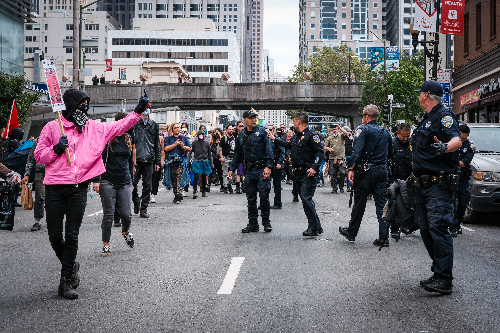

# ianshootsphotos: a photography portfolio

## about my work
Hi! My name is Ian and I'm a photographer based in the San Francisco Bay Area. Being born and raised in the Bay, I've seen and experienced how our region's runaway economic inequality creates an environment for working class people defined by struggle under gentrification, displacement, and constant change. Yet, despite the hustle, the Bay remains a place of culture, radical thought, and beauty.

Does anyone really own anything in the Bay? If we don't, then what do we do *now* to make such a place *home*?

The main purpose of my work is to document the Bay- particularly its BIPOC punk, art, and activist subcultures- as they are now before this place inevitably changes along with its communities. You can find most of my work on Instagram at [@ianshootsphotos](https://instagram.com/ianshootsphotos). I also occasionally upload videos to my YouTube at [ianshootsvideos](https://www.youtube.com/@ianshootsvideos).

I also have experience as a photojournalist, with credits in publications including Berkeleyside, Street Spirit, and SF Chronicle. In the past, I've freelanced for the Berkeley Times, Oakland Roots Sports Club, and various community organizations, venues, and artists. That being said, to pay the rent, my day job is in applied data science - you can learn more about me professionally on this site's main page [here](https://castroian.github.io/).

I am available for hire (news, concerts, fashion, you name it) and love talking to other artists - DM me on Instagram or email me at [iancastromedia(at)gmail.com](mailto:iancastromedia@gmail.com). Let's connect!

## selected photos [last updated winter 2024]

### music

### fashion

### news

### events

I'm constantly trying to learn and improve my craft. If you want to see my past portfolios (and other favorite photos), you can view them here:

[spring 2022](https://castroian.github.io/ianshootsphotos/spring22)

[summer 2022](https://castroian.github.io/ianshootsphotos/summer22)
