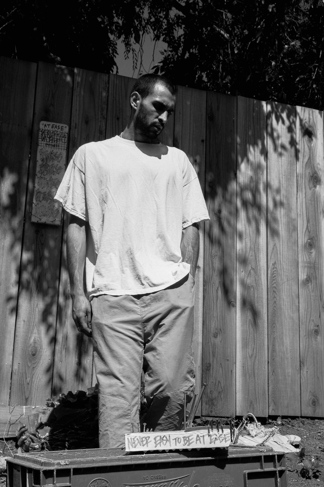

# ianshootsphotos: a photography portfolio

## about my work
Hi! I'm a freelance photojournalist based in the San Francisco Bay Area. I primarily post my work on Instagram at [@ianshootsphotos](https://instagram.com/ianshootsphotos). I currently work on assignment for the [Berkeley Times](http://berkeleyx.org/), a print-only community newspaper for the city of Berkeley. I mostly do photography as a part-time gig and hobby; my primary job is an applied data scientist - you can learn more about me professionally on this site's main page [here](https://castroian.github.io/).

My main equipment includes a Fujifilm XT-4, XE-3, and Pentax K1000. I enjoy documenting the Bay Area DIY/punk scene and local protests. Contact me if you need a photographer! You can DM me on Instagram or email me at [castro.ian(at)berkeley.edu](mailto:castro.ian@berkeley.edu).

I'm constantly trying to learn and improve my craft! If you want to see my past work, you can find my old portfolios here:
[spring 2021](https://castroian.github.io/ianshootsphotos/spring22)

# selected photos [last updated summer 2022]

### editorial

### event

### model

### concert

