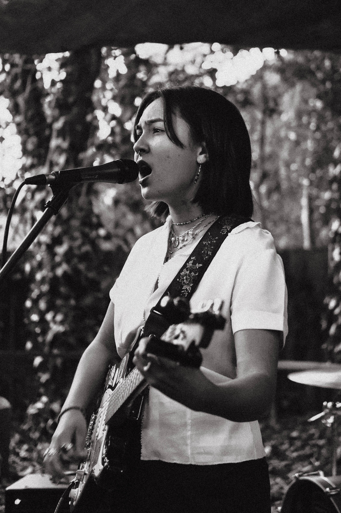

# ianshootsphotos: a photography portfolio

## about my work
This page is a placeholder until I can figure out how to make a better website. If you're interested in viewing more of my photos or following me, I post my work on Instagram at [@ianshootsphotos](https://instagram.com/ianshootsphotos). I'm learning photography as a hobby; you can learn more about me professionally on this site's main page [here](https://castroian.github.io/).

I mostly shoot street photography and events with a Fujifilm XE-3 and Pentax K1000. I focus on documenting the Bay Area DIY/punk scene and local protests. Contact me if you need a photographer at your event! You can DM me on Instagram or email me at [castro.ian(at)berkeley.edu](mailto:castro.ian@berkeley.edu).

## selected photos

